# 2025年金华婺城、金东小学六年级教育质量综合测评卷

(考试时间:90 分钟 满分:100 分) 2025 年 6 月考

班级：\_\_\_\_ 姓名：\_\_\_\_ 学号：\_\_\_\_

## 一、填空题（第2题4分，其余每题2分，共26分）

1. 太平洋是世界上最大的洋, 它的面积约是一亿八千一百三十四万四千平方千米。横线上的数写作( ), 四舍五入到亿位约是( )亿。

2. 右图中涂色部分与整个图形的面积关系可以用下面的式子表示：

( ) : $8=\frac{(\quad)}{16}=12\div(\quad)=(\quad)\%$

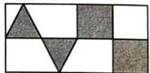

3.用 36 个棱长为 $1 \mathrm{~cm}$ 的小正方体搭成一个大长方体, 已知大长方体的底面是一个边长为 $2 \mathrm{~cm}$ 的正方形, 则这个大长方体的高为 ( ) cm。

4.下面是2024全国游泳锦标赛女子50米蝶泳决赛成绩表,其中部分数字被遮挡。已知这三位运动员的比赛成绩非常接近,王一淳的成绩是( )秒,张雨霏比王一淳快( )秒。

<table><tr><td>运动员</td><td>张雨霏</td><td>王一淳</td><td>余依婷</td></tr><tr><td>成绩/秒</td><td>★5.16</td><td>2★.41</td><td>25.46</td></tr><tr><td>奖牌</td><td>金牌</td><td>银牌</td><td>铜牌</td></tr></table>

5.《水浒传》是我国四大古典名著之一,作者成功塑造了“水泊梁山108位好汉”的形象。108的因数有( )个,从这个数的因数中选出4个数组成一个比例:( )。

6. 小红本次体育抽测的成绩是 91 分, 王老师将它记作 +3 分; 小明的成绩单不小心被墨水弄脏了, 小明的体育抽测成绩可能 ( ) 分, 也可能 ( ) 分。

<table><tr><td>姓名</td><td>成绩</td><td>记作</td></tr><tr><td>小红</td><td>91分</td><td>+3分</td></tr><tr><td>小明</td><td></td><td>5分</td></tr></table>

7.一幅地图的比例尺是0 40 80 120 km,把它改写成数值比例尺是( );已知A、B两地在这幅地图上的距离是4.5 cm,A、B两地的实际距离是( )km。

8. 古希腊的毕达哥拉斯喜欢用石子摆数, 他发现当小石子的数量是 $1,3,6,10 \cdots$ 时, 都能摆成等边三角形。这样的数称为“三角形数”, 如下图:

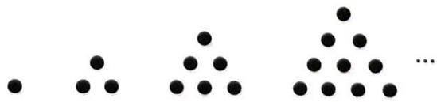

natural_image

Abstract pattern of black dots arranged in triangular clusters on white background (no text or symbols)

(1)第6个三角形数是( )。

(2)观察图与数的关系,第( )个三角形数是36。

9.商家要给右面的箱子打包(单位:cm),其打包方式如图所示,则打包带的长度至少要( )cm。(打结处忽略不计)

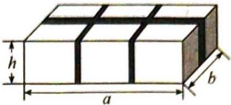

text_image

h
a
b

10.仔细观察下图中的3道计算题,整数、小数、分数加减法计算方法的相同点是( )。

(1) $\frac{+165}{199}$ 个位对齐(2) $\frac{-2}{1}\cdot\frac{1}{5}\cdot\frac{2}{8}$ 小数点对齐

(3) $\frac{1}{2}+\frac{3}{8}=\boxed{\frac{4}{8}+\frac{3}{8}}=\frac{7}{8}$ 通分

11. 学校组织看了神舟十九号载人飞船发射后, 淘气打算用一块棱长为 $6 \mathrm{~cm}$ 的正方体橡皮泥做一个由等底等高的圆柱和圆锥组合而成的最大“火箭”模型, 其中圆锥的体积是 $(\quad)\mathrm{cm}^{3}$ , 圆柱的体积是 $(\quad)\mathrm{cm}^{3}$ 。

12. 李老师正在上传一份大小为 860 MB 的文件。页面显示已经上传了 40%, 用时 1 分 26 秒。这份文件已经上传了( )MB。照这样的速度, 上传完整份文件, 一共需要( )秒。

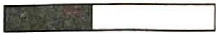

状态：正在上传中……
已上传：40%

## 二、选择题(每题1分,共10分)

1. 下列百分率中, 可能超过 $100\%$ 的是( )。

A. 种子的成活率

B. 一次测试的及格率

C. 销售量的增长率

D. 大豆的出油率

2.世界上最大的立体造型温度计是我国新疆吐鲁番火焰山的“金箍棒”。程程去旅游时为了知道“金箍棒”的高度,测量了同一时刻他自己和“金箍棒”的影长,程程的影长是34厘米,“金箍棒”的影长是240厘米。已知程程的身高为1.7米,则“金箍棒”高( )米。

A. 1.2

B. 12

C. 4.8

D. 48

3.如图,图②是将图①中半圆 BMO 以点 O 为中心旋转得到的。若 AO=10 cm,则图①中涂色部分的周长是( )cm。

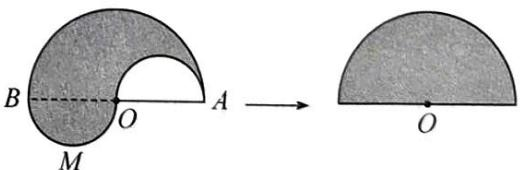

text_image

B
O
A
M
→
O

B. 31.4

图①

图②

A. 62.8

C. 51.4

D. 41.4

4.前两天,王叔叔网购了一件商品,今天收到快递。快递包装箱的尺寸是 $7 \mathrm{dm} \times 6 \mathrm{dm} \times 15 \mathrm{dm}$ 。它可能是( )。

A. 手机

B. 笔记本电脑

C. 鞋子

D. 冰箱

5.用四根木条制作一个长方形框架,将它的两个对角慢慢向两边拉动,每次拉动形成的平行四边形的面积和高()。

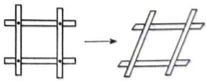

natural_image

Diagram showing two structural frame arrangements, one with vertical supports and one with horizontal beams, both without any text or symbols.

A. 成正比例

B. 成反比例

C.不成比例

D. 可能成正比例也可能成反比例

6.冬至是一年中黑夜最长、白昼最短的一天。2024年冬至是12月21日，某市日出时间是7:33，日落时间是16:53。下面表述错误的是（ ）。

A. 冬至这天该市黑夜时间与白昼时间的比是 11:7

B. 冬至这天该市黑夜时间比白昼时间多 $\frac{4}{11}$

C. 冬至这天该市白昼时间占全天时间的 $\frac{7}{18}$

D. 冬至这天该市黑夜时间约占全天时间的 $61\%$

7.下面的图和算式,其中画方框部分表示0.6的是()。

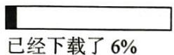  
A.

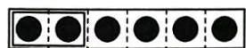  
B.

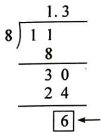  
C.

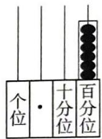  
D.

8.如图,用 8 个完全相同的小长方形可以拼成一个大长方形,每个小长方形的面积是( )cm²。

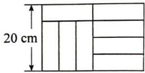

text_image

20 cm

A. 96

B. 75

C. 50

D. 64

9. 黑色袋子里有红、黄两种颜色的球各 3 个(除颜色外完全相同), 要想保证摸出的球中一定有两个是同色的, 则摸出球的个数至少有( )个。

A. 2

B. 3

C. 4

D. 5

10.下面说法错误的有( )个。

①在折线统计图中,折线越缓,说明数据的变化越大;折线越陡,说明数据的变化越小。

②3:4 的前项加上 9, 要使比值不变, 后项应该加上 12。

③连续的两个月最多有62天,最少有58天。

④一种体育彩票的中奖率是1%，小李买了100张彩票，一定会有1张中奖。

A. 1

B. 2

C. 3

D. 4

## 三、计算题(26 分)

1. 直接写出得数。(每题 1 分, 共 8 分)

$$
1. 2 \times 0. 6 =
$$

$$
0. 5 ^ {2} - 0. 3 ^ {2} =
$$

$$
\frac {2}{8} + \frac {5}{8} \times 0 =
$$

$$
2. 5 \times 0. 4 \div 2. 5 =
$$

$$
2 3. 9 \div 8. 1 \approx
$$

$$
3 5 \pi \div 5 \pi =
$$

$$
4 2 \div 0. 3 =
$$

$$
1 + 20 \% - 30 \% =
$$

2.用递等式计算。(每题3分,共12分)

$$
\frac {8}{9} \times \frac {2}{5} \div \frac {8}{1 5}
$$

$$
\frac {3}{5} \times 2 4 + 7 \times 0. 6 - \frac {3}{5}
$$

$$
9. 8 3 - (4. 9 3 + 2 \frac {1}{4})
$$

$$
2 4 \div (\frac {5}{1 2} - \frac {3}{8}) \times \frac {1}{4 8}
$$

3. 解方程或比例。(每题 2 分, 共 6 分)

$$
\frac {2}{3} x - 1 4 = 4
$$

$$
\frac {1}{2}: \frac {1}{6} = x: 1. 2
$$

$$
6 0 + 5 x = 9 0
$$

## 四、操作与分析(11 分)

1. 按要求画图。(4 分)

(1)把图中的长方形绕点 A 逆时针旋转 $90^{\circ}$ ，画出旋转后的图形。旋转后点 B 的位置用数对表示是（，）。

(2)画出一个与长方形面积相等的三角形。如果按 2:1 的比将三角形放大, 放大后的三角形与原来三角形的面积比是( )。

2.根据要求,画出到点 A 的距离等于 3 厘米的所有的点。(2 分)

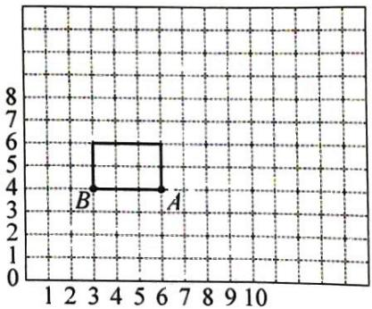

text_image

B
A

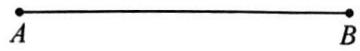

3. 求出右面图形的体积。(单位: cm)(3 分)

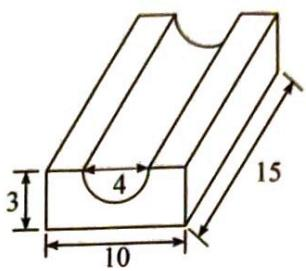

text_image

3
4
10
15

4. 小探究: 你能比较 $16 \times 28$ 和 $18 \times 26$ 的乘积谁大谁小吗? 笑笑这样想:

$$
\boxed {\begin{array}{l}1 6 \times 2 8 = 1 6 \times (2 6 + 2) = 1 6 \times 2 6 + 1 6 \times 2 \text {小}\\1 8 \times 2 6 = (1 6 + 2) \times 2 6 = 1 6 \times 2 6 + 2 \times 2 6 \text {大}\end{array}} \rightarrow \boxed {1 6 \times 2 8 <   1 8 \times 2 6}
$$

请你也像笑笑那样,分析 $71 \times 34$ 和 $69 \times 36$ 的乘积谁大谁小。(2 分)

## 五、解决问题(27分)

1.为了预防感冒,某学校六(1)班老师用13升姜汁加水调制了55升姜汤。校医说:“当姜汁和水的比是3:7时,效果最佳。”为了使调制的姜汤效果最佳,应该再往调制的姜汤中加多少升姜汁?(4分)

2.六一儿童节,爸爸送给张伟一个圆锥形的玩具(如右图),如果要用一个长方体的盒子包装它,这个盒子的表面积至少是多少平方厘米?(4分)

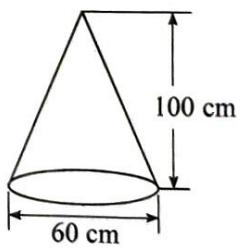

text_image

100 cm
60 cm

3. 萍萍和爸爸、妈妈一起去看电影, 电影票原价 45 元/张 (成人和儿童的票价相同), 经比较以后, 他们选择了有优惠的场次, 三张票共节省了 27 元。他们看的是哪一场? (4 分)

<table><tr><td colspan="2">优惠方式</td></tr><tr><td>上午场(9:00—11:00)</td><td>六折</td></tr><tr><td>下午场(13:00—15:00)</td><td>八折</td></tr><tr><td>其他时段</td><td>原价</td></tr></table>

4.金华市青少年乒乓球锦标赛使用36张球桌进行比赛,其中单打和双打同时进行,现场共有118名运动员参与比赛。请问:有几张桌是单打,几张桌是双打?(4分)

5.如图，张叔叔从A市途经B城匀速驾车到C市。

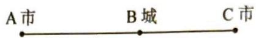

信息 1: A、B 两地与 B、C 两地的路程比是 4:3;

信息 2: 张叔叔从 A 市出发, 以 80 km/h 的速度行驶了 2.5 小时到达 B 城。

信息 3: 当汽车行驶 20 km 时, 耗油量是 2.4 L。

信息 4: 张叔叔到达 B 城后, 休息 1.5 小时继续驾车向 C 市出发。

(1)A市到C市的路程是多少千米？(2分)

(2)假设每千米的耗油量不变,当耗油量达到30 L时,这辆汽车行驶了多少千米?(3分)

6. 下图是反映芳芳家平均每月家庭支出情况的不完整统计图。(6 分)

芳芳家平均每月家庭支出情况扇形统计图

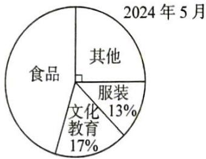

pie chart

2024年5月
| Category | Percentage (%) |
|---|---|
| 食品 | 17 |
| 文化教育 | 13 |
| 服装 | 13 |
| 其他 | 0 |

芳芳家平均每月家庭支出情况条形统计图

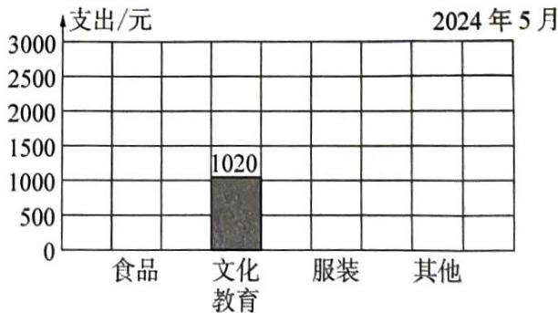

bar chart

2024年5月
| 类别 | 支出/元 |
|---|---|
| 食品 | 0 |
| 文化教育 | 1020 |
| 服装 | 0 |
| 其他 | 0 |

(1)芳芳家平均每月家庭总支出是( )元。(1分)

(2)根据以上信息,将条形统计图补充完整。(3分)

(3)国际上通常用食品支出占家庭总支出的百分比(即恩格尔系数)来衡量一个地区的人民生活水平,如下表:

<table><tr><td>恩格尔系数</td><td>59%以上</td><td>50%~59%</td><td>40%~50%</td><td>40%以下</td></tr><tr><td>生活水平</td><td>贫困</td><td>温饱</td><td>小康</td><td>富裕</td></tr></table>

参照恩格尔系数,芳芳家处于什么生活水平?(在正确答案后面的□里画“√”)(2分)

贫困□ 温饱□ 小康□ 富裕□