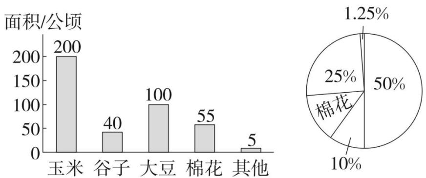
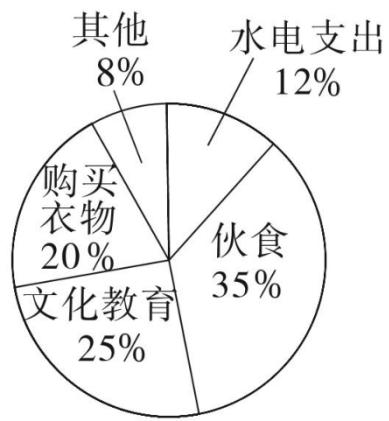
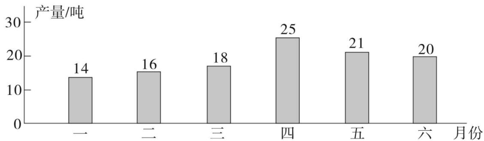
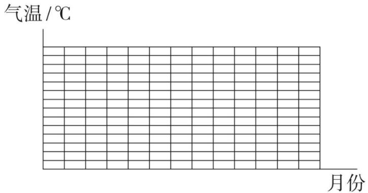
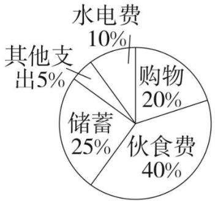

5. 周庄共有 400 公顷耕地, 秋季农作物的种植如图。结合两图可知周庄棉花的种植面积占总面积的( ), 扇形统计图中 $10 \%$ 所代表的农作物是( )。( )

bar chart

| 类别 | 面积/公顷 |
|---|---|
| 玉米 | 200 |
| 谷子 | 40 |
| 大豆 | 100 |
| 棉花 | 55 |
| 其他 | 5 |

| 类别 | 数值 |
| :--- | :--- |
| 玉米 | 200 |
| 谷子 | 40 |
| 大豆 | 100 |
| 棉花 | 55 |

| 占比 (%) | 数值 |
| :--- | :--- |
| 玉米 | 1.25 |
| 谷子 | 25 |
| 大豆 | 50 |
| 棉花 | 10 |

A. 13.75%,谷子

B. $13\%$ ，谷子

C. 13.75%, 棉花

D. 13.75%, 大豆

## 三、聪聪家 2018 年 5 月支出情况统计如下图, 其中该月的总支出是 3600 元。请你回答问题。(18 分)

1. 这个月哪项支出最多？支出了多少元？

2. 文化教育支出了多少元？购买衣物支出了多少元？

pie chart

| 类别 | 占比 (%) |
| :--- | :--- |
| 水电支出 | 12 |
| 伙食 | 35 |
| 文化教育 | 25 |
| 购买衣物 | 20 |
| 其他 | 8 |

3. 购买衣物的支出比文化教育支出少百分之几？少支出了多少元？

## 四、阳光食品公司 2018 年上半年生产情况统计图。(18 分)

bar chart

| 月份 | 产量/吨 |
| :--- | :--- |
| 一 | 14 |
| 二 | 16 |
| 三 | 18 |
| 四 | 25 |
| 五 | 21 |
| 六 | 20 |

1. ( )月份的产量最高，( )月份的产量最低。

2. 上半年月平均产量是多少吨?

3. 六月份产量比二月份增长百分之几?

## 五、琳琳将去年本地区上半年月平均气温做了如下统计:(10 分)

<table><tr><td>月份</td><td>1</td><td>2</td><td>3</td><td>4</td><td>5</td><td>6</td></tr><tr><td>气温/°C</td><td>0</td><td>1</td><td>2</td><td>7</td><td>12</td><td>18.5</td></tr></table>

根据统计表完成下面统计图。

line chart

气温/℃
月份
| 月份 | 气温 (℃) |
|---|---|
| 1月 | 0 |
| 2月 | 0 |
| 3月 | 0 |
| 4月 | 0 |
| 5月 | 0 |
| 6月 | 0 |
| 7月 | 0 |
| 8月 | 0 |
| 9月 | 0 |
| 10月 | 0 |
| 11月 | 0 |
| 12月 | 0 |
| 1月 | 0 |
| 2月 | 0 |
| 3月 | 0 |
| 4月 | 0 |
| 5月 | 0 |
| 6月 | 0 |
| 7月 | 0 |
| 8月 | 0 |
| 9月 | 0 |
| 10月 | 0 |
| 11月 | 0 |
| 12月 | 0 |

附加题。(10 分)

如图是小明家四月份支出及储蓄情况统计图。

pie chart

| 类别 | 占比 (%) |
|---|---|
| 水电费 | 10 |
| 购物 | 20 |
| 伙食费 | 40 |
| 储蓄 | 25 |
| 其他支出 | 5 |

1. 小明家四月份的伙食费共花了 800 元, 小明家的总支出及储蓄分别是多少元?

2. 根据扇形统计图, 把下表填写完整。

<table><tr><td>项目</td><td>伙食费</td><td>购物</td><td>水电费</td><td>储蓄</td><td>其他支出</td><td>总计</td></tr><tr><td>费用/元</td><td>800</td><td></td><td></td><td></td><td></td><td></td></tr><tr><td>百分比</td><td>40%</td><td></td><td></td><td></td><td></td><td></td></tr></table>

