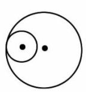
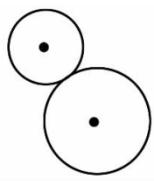
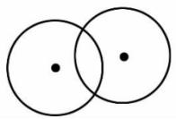
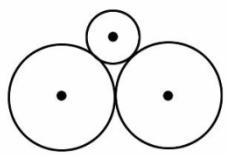

# 黄冈名卷

# 第一单元知识回顾与检测

## 圆

满分:100 分 时间:60 分钟

<table><tr><td>题 号</td><td>一</td><td>二</td><td>三</td><td>四</td><td>五</td><td>六</td><td>附加题</td><td>总 分</td></tr><tr><td>得 分</td><td></td><td></td><td></td><td></td><td></td><td></td><td></td><td></td></tr></table>

## 一、填空。（22分）

1. 从( )到( )任意一点的线段叫作半径;通过( )并且两端都在( )的线段叫作直径。在同一个圆里,直径的长度是半径的( )。  
2. 画圆时, 圆规针尖固定的一点是圆的( ), 它决定圆的( ), 圆规的两脚叉开的距离是所画圆的( ), 它决定圆的( )。  
3. 一个车轮转动一周,前进多少米是指圆的( )。  
4. 把一张圆形纸片至少折( )次, 就可以找到圆心。  
5. 用圆规画一个直径为 16 厘米的圆, 圆规两脚之间的距离是( )厘米, 所画圆的周长是( )厘米, 面积是( )平方厘米。  
6. 在一个周长是 8 分米的正方形纸片上剪一个最大的圆, 这个圆的直径是 ( ) 分米, 面积是 ( ) 平方分米。  
7. 大圆半径是小圆半径的 2 倍, 大圆面积比小圆面积多 12 平方厘米, 小圆面积是( )平方厘米。  
8. 一个圆的半径扩大为原来的 2 倍, 它的周长扩大为原来的 ( ) 倍, 面积扩大为原来的 ( ) 倍。  
9. 把一个圆分成若干等份, 剪开拼成一个近似的长方形。这个长方形的长相当于( ), 长方形的宽就是圆的( )。  
10. 最早解决“轮子滚动的距离与轮子直径之间关系”的方案是( )，而这种方法往往因精确程度不够,影响计算圆周率的精确程度。

## 二、判断。(10 分)

1. 圆周率与圆的大小有关。  
2. 两个圆的半径相等, 它们的周长相等, 面积也一定相等。 ( )

3. 将一个圆形铁丝圈拉成长方形, 长方形与原来圆的周长相等。（）  
4. 直径为 5 厘米的圆比半径为 3 厘米的圆面积大。 （）  
5.两端都在圆上的所有线段中,直径是最长的一条。()

## 三、选择。(10 分)

1. 下面三种图形中, 对称轴最多的图形是( )。

A. 长方形

B. 正方形

C. 圆

2. 两个直径不同的圆, 它们的周长( )。

A.相等

B. 不相等

C. 有时相等

3. 在一张长 $6 \, cm$ 、宽 $4 \, cm$ 的长方形纸中剪出一个最大的圆，这个圆的半径是（）。

A. $4 \mathrm{~cm}$

B. $6 \mathrm{~cm}$

C. $2 \mathrm{~cm}$

4. 右图中, 三个圆的圆心在一条直线上, 那么大圆的周长( )两个小圆的周长之和。

A. 大于

B. 等于

C. 小于

5. 在一个正方形里画一个最大的圆, 这个圆的面积是正方形面积的( )。

A. $\frac{1}{4}$

B. $\frac{3}{4}$

C. $\frac{\pi}{4}$

## 四、操作题。(22 分)

1. 以 O 点为圆心, 画一个直径是 3 cm 的圆。(4 分)

• O

2. 分别画出下面图形的对称轴。(4分)

