## 期末专项训练二 数的运算

测试时间:90 分钟 总分:100 分

<table><tr><td>题号</td><td>一</td><td>二</td><td>三</td><td>四</td><td>总分</td></tr><tr><td>得分</td><td></td><td></td><td></td><td></td><td></td></tr></table>

## 一、细心读题，谨慎填写。（每空1分，共26分）

1. 算式 $68 \times 0.53 + 68 \times 0.47 = 68 \times (0.53 + 0.47)$ 运用了乘法（）律。

2. 根据 $28 \times 23 = 644$ ，直接写出下面各题的得数。

$$
2 8 \times 0. 2 3 = (\quad) \quad 0. 2 8 \times 2. 3 = (\quad) \quad 6. 4 4 \div 2 3 = (\quad) \quad 6 4 4 \div 0. 2 8 = (\quad)
$$

3. 在○里填上“＞”“＜”或“＝”。

$$
\frac {3}{8} \div \frac {5}{3} \bigcirc \frac {3}{8}
$$

$$
\frac {9}{6} \times \frac {8}{7} \bigcirc \frac {9}{6}
$$

$$
\frac {2}{3} \times 1 \bigcirc \frac {2}{3}
$$

$$
6 \div 0. 1 5 \bigcirc 6 \times \frac {4}{3}
$$

4.(1)15的40%是( ),12是( )的80%。

(2)16 kg 比( )kg 多 $\frac{1}{7}$ ，比 30 kg 少 $\frac{1}{3}$ 的是( )kg。

5. 康康晨跑, $\frac{1}{5}$ 时跑了 $\frac{4}{3} \mathrm{~km}$ 。他平均每时跑( )km, 平均每千米用( )时。

6. 已知 $a \div b = 13 \cdots 5$ ，则 $100a \div 100b = (\quad) \cdots (\quad)$ 。

7. 把 $12 \div 7$ 的商用循环小数表示是( ), 小数点后面第 2011 位上的数字是( )。

8. 心心在计算一个数除以 2.4 时, 粗心地算成一个数乘 2.4, 得到的结果是 144, 原题的正确结果是( )。

9. 某演播厅共有 620 个观众席。康康学校五年级有 287 人, 六年级有 309 人, 估计一下, 两个年级的学生来看演出, ( ) (填“能”或“不能”) 坐下。我是这样估算的: \_\_\_\_。

10. 欣欣商店新进了一批钥匙扣，“雪容融”钥匙扣是“冰墩墩”的 $\frac{3}{4}$ 。如果“雪容融”钥匙扣有240个，“冰墩墩”钥匙扣有（ ）个。

11. 李叔叔买了 5000 元国家债券, 定期两年, 年利率是 3.25%, 到期时他可得本金和利息共 ( )元。

12. 一辆货车从甲地到乙地需要行驶6时,一辆客车从乙地到甲地需要行驶4时,如果两车同时从甲、乙两地出发,相向而行,( )时相遇。

13.（2021·贺州）甲、乙两种衬衣的原价相同。换季时，甲种衬衣按五折销售，乙种衬衣按四折销售，王叔叔用180元购买这两种衬衣各一件。乙种衬衣原价每件（ ）元。

## 二、反复比较,正确选择。(将正确答案前的字母填在括号里)(每小题2分,共10分)

1. 下面( )图可以表示 $\frac{3}{4}\times\frac{1}{2}$ 的意义。

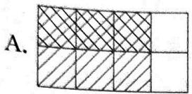

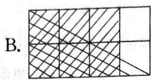

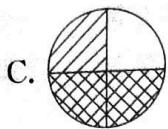

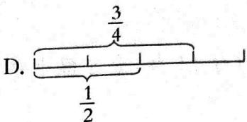

text_image

D.
3/4
1/2

2. 把 $52 + 44 = 96, 1728 \div 96 = 18, 50 - 18 = 32$ 列成综合算式，正确的是()。

A. $1728 \div (52 + 44) - 50$

B. 50-1728÷(52+44)

C. 50-1728÷52+44

D. 50-1728÷44+52

3. 学校举行广播体操表演, 每行有 12 人, 一共有 14 行。童童通过下面的竖式计算知道一共有 168 人参加表演。竖式中箭头所指的“12”可以用选项( )中的点阵图来表示。12

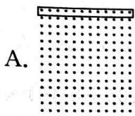

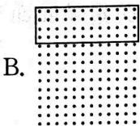

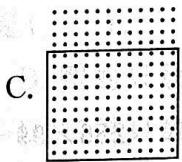

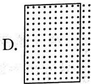

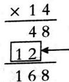

4. 已知 a, b, c 是三个大于 0 的数，并且 $a \times \frac{5}{3} = b \div 25\% = c \times \frac{3}{4}$ ，那么 a, b, c 中最小的数是（）。

A. $a$

B. b

C. c

D. 无法确定

5. 爷爷从冷饮批发部购进了 5 箱冰淇淋来销售, 批发价为每箱 17 元, 每箱有 20 支。如果爷爷每支卖 1.5 元, 一共能赚多少钱? 下面列式正确的是()。

A. $17 \times 5$

B. $1.5 \times 20 \times 5$

C. $1.5 \times 20 \times 5 - 17 \times 5$

D. $17 \times 5 - 20 \times 5$

## 三、注意审题，细心计算。（共41分）

1. 直接写得数。(8 分)

$$
4 5 + 3 6 =
$$

$$
8 1 0 - 3 5 0 =
$$

$$
1 5 \times 5 0 =
$$

$$
4 2 0 \div 3 0 =
$$

$$
1 0 - 0. 7 =
$$

$$
7. 3 \div 0. 1 =
$$

$$
\frac {7}{5} + \frac {8}{5} =
$$

$$
3 - \frac {3}{8} =
$$

$$
\frac {2}{3} \times \frac {1}{2} =
$$

$$
\frac {1}{4} \div \frac {1}{8} =
$$

$$
5. 6 3 + 4. 3 7 =
$$

$$
0. 2 5 \times 0. 4 =
$$

$$
9 0 3 - 3 0 4 \approx
$$

$$
8 9 8 + 1 0 3 \approx
$$

$$
2 1 \times 3 9 7 \approx
$$

$$
7 2 3 \div 7 8 \approx
$$

2. 用竖式计算。(带☆的要验算)(9分)

$$
3 6 2 4 - 8 2 5 =
$$

$$
1 0. 4 + 8. 7 4 =
$$

$$
5. 4 \times 1. 0 3 =
$$

$$
\star 1 2. 4 8 \div 3. 2 =
$$

3. 计算下列各题,能简算的要简算。(18 分)

$$
5 3 5 + 6 8 3 - 1 3 5
$$

$$
2 1. 8 - 4. 7 - 5. 3
$$

$$
1. 2 5 \times 2. 5 \times 3 2
$$

$$
1 0 - \frac {2}{7} \div \frac {9}{1 4} - \frac {5}{9}
$$

$$
2. 8 3 \times \frac {3}{7} + 4. 1 7 \div \frac {7}{3}
$$

$$
2 0 2 2 \times \frac {2 0 2 0}{2 0 2 1}
$$

$$
\frac {5}{1 1} \times \left[ \left(\frac {2}{5} + \frac {1}{3}\right) \div \frac {5}{6} \right]
$$

$$
2 5 6 \times 9 9 + 6
$$

$$
7 8. 2 \div [ (1. 2 5 + 0. 4 5) \times 2 3 ]
$$

4. 看图列式计算。(6 分)

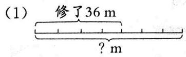

text_image

(1) 修了36m
?m

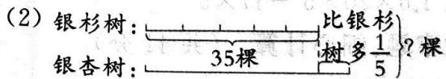

text_image

(2) 银杉树: 35棵 比银杉树多1/5}?棵
银杏树:

## 四、走进生活，解决问题。（共23分）

## 黄河流域生态保护和高质量发展座谈会

习近平主席在郑州主持召开黄河流域生态保护和高质量发展座谈会并发表重要讲话。他强调，要坚持绿水青山就是金山银山的理念，坚持生态优先、绿色发展……让黄河成为造福人民的幸福河。

## 生态保护篇

黄河生态系统是一个有机整体,我们要充分考虑周围的生态环境,积极植树造林,保护母亲河。

1. 已知甲队 3 月上旬植树 350 棵, 3 月中旬植树棵数比上旬多 $20\%$ , 比下旬少 $\frac{1}{3}$ , 那么甲队 3 月一共植树多少棵? (先用线段图表示上旬、中旬植树棵数的数量关系, 再解答) (6 分)

2. 为了改善黄河流域两边的生态环境, 避免水土流失, 乙队计划每天植树 80 棵, 则比原计划预定时间提前 6 天植完; 如果每天植树 50 棵, 则会比原计划预定时间推迟 3 天植完, 总共要植树多少棵? (6 分)

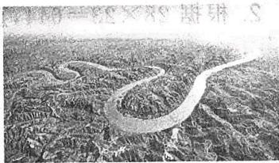

natural_image

Aerial view of a winding river cutting through dense forested terrain (no visible text or symbols)

## 节约用水篇

## ↓

黄河的水资源量是有限的,搞生态建设要用水,发展经济、吃饭过日子也离不开水,不能把水当作无限供给的资源。为了节约用水,自来水厂规定:每人每月用水不超过3吨的,按每吨3.5元收费,超过3吨的部分按每吨4元收费。

3. 康康家除了康康还有爷爷、奶奶、爸爸、妈妈，他们家5月份共用水18吨，照这样计算，他们应交水费多少元？（5分）

## 黄河游玩篇

## ↓

郑州的黄河风景名胜区处于中华民族发源地的核心部位,景区历史古迹丰富,文化遗产深厚。景区每年接待上百万中外游客,被誉为万里黄河上的一颗璀璨的明珠。

4. 家在徐州的张老师计划和朋友相约前往郑州黄河风景名胜区游玩。张老师开车从徐州出发，已经行驶了全程的 $\frac{3}{10}$ ，再行驶 $74 \mathrm{~km}$ 就到路程的一半，此时张老师距离郑州还有多远？（6分）

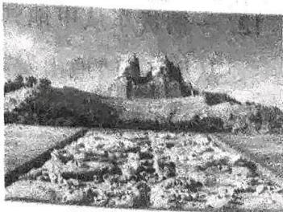

natural_image

Black-and-white landscape photo showing a rocky outcrop with sparse vegetation and distant hills (no visible text or symbols)

